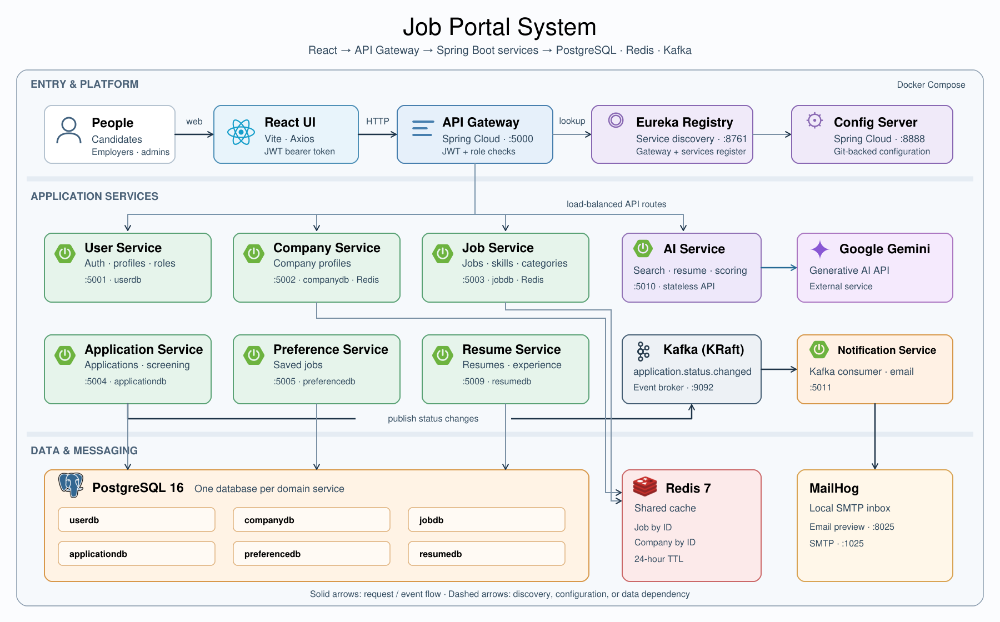

# Job Portal — Microservices Platform

An **AI-assisted Job Portal System** built with Spring Boot microservices, a React frontend, event-driven notifications, and Spring Cloud infrastructure. The platform covers the recruitment lifecycle — from job search and resume creation through applications, AI candidate screening, and hiring status updates.

---

## Table of Contents

1. [Features](#features)
2. [Architecture Overview](#architecture-overview)
3. [Services](#services)
4. [Data Flow](#data-flow)
5. [Technology Stack](#technology-stack)
6. [Design Patterns](#design-patterns)
7. [Security](#security)
8. [API Reference](#api-reference)
9. [Running the Project](#running-the-project)
10. [Smoke Test](#smoke-test)
11. [Configuration](#configuration)
12. [Known Limitations](#known-limitations)

---

## Features

### For Job Seekers (Candidate-Facing)

- **Job Search** — Filter by keyword, category, skills, tags, company, location, salary, job type, work mode, experience level, status, and openings; paginate and sort results
- **Resume Builder** — Manage personal information, education, work experience, skills, projects, and languages; choose a template, visibility, and default resume
- **AI Resume Assistance** — Generate professional summaries and work experience bullet points
- **Job Applications** — Apply with a resume, cover letter, expected salary, and availability date
- **AI Application Assistance** — Generate cover letters and identify skills gaps
- **Application Management** — View submitted applications and withdraw applications
- **Saved Jobs** — Save and remove jobs from a personal shortlist
- **Status Update Emails** — Receive HTML email updates when an employer changes an application's status
- **Profile Management** — Maintain account and contact information

### For Employers

- **Company Profiles** — Create and manage company details and social links
- **Job Management** — Create, edit, publish, close, and delete job postings
- **Job Metadata** — Associate categories, skills, and tags with postings
- **AI Job Assistance** — Generate job descriptions and suggest skills
- **Applicant Management** — Review applications by job or company, filter candidates, star applications, and add notes
- **Hiring Workflow** — Update statuses including reviewing, shortlisted, interview scheduled, rejected, and hired
- **AI Candidate Screening** — Compare resumes against job requirements, with overall and component scores, matched/missing skills, strengths, and concerns

### For System Administrators

- **User Management** — Manage users and account status through the administration interface
- **Company Moderation** — Verify or deactivate companies
- **Job Metadata Management** — Maintain job categories, skills, and tags
- **Centralized Configuration** — Service settings loaded from a Git-backed Config Server
- **Service Discovery** — Eureka-based dynamic service registration

---

## Architecture Overview



Text version for terminal readers:

```text
                    ┌──────────────────────────────────────────┐
                    │       REACT FRONTEND (Vite :5173)         │
                    └────────────────────┬─────────────────────┘
                                         │ HTTP :5000
                    ┌────────────────────▼─────────────────────┐
                    │              API GATEWAY                 │
                    │          JWT Auth · Routing · CORS       │
                    └────────────────────┬─────────────────────┘
                                         │ Eureka / Load Balancer
          ┌──────────────┬───────────────┼──────────────┬──────────────┐
          ▼              ▼               ▼              ▼              ▼
     ┌─────────┐   ┌───────────┐   ┌───────────┐  ┌───────────┐  ┌───────────┐
     │  User   │   │  Company  │   │    Job    │  │  Resume   │  │Preference │
     │ Service │   │  Service  │   │  Service  │  │  Service  │  │  Service  │
     └─────────┘   └───────────┘   └───────────┘  └───────────┘  └───────────┘
                                         │ Feign
                    ┌────────────────────▼─────────────────────┐
                    │           APPLICATION SERVICE            │
                    │  Calls User · Company · Job · Resume     │
                    └──────────┬─────────────────┬─────────────┘
                               │ Feign           │ Status-change event
                    ┌──────────▼────────┐  ┌─────▼────────────────────┐
                    │    AI SERVICE     │  │      APACHE KAFKA        │
                    │    Google Gemini  │  │application.status.changed│
                    └───────────────────┘  └─────┬────────────────────┘
                                                 ▼
                                       ┌─────────────────────────┐
                                       │  NOTIFICATION SERVICE   │
                                       │  HTML Email → MailHog   │
                                       └─────────────────────────┘

                    ┌──────────────────────────────────────────┐
                    │             INFRASTRUCTURE               │
                    │ Eureka · Config Server · PostgreSQL      │
                    │ Per-service databases · Redis Cache      │
                    └──────────────────────────────────────────┘
```

---

## Services

### Infrastructure Services

| Service | Port | Role |
|---|---|---|
| **API Gateway** | 5000 | Single entry point — JWT validation, routing, CORS |
| **Config Server** | 8888 | Centralized service configuration pulled from Git |
| **Service Registry** | 8761 | Eureka — service registration and discovery |
| **Kafka** | 9092 | Application status events (KRaft mode — no Zookeeper) |
| **PostgreSQL** | 5432 locally | Dedicated database per persistent business service |
| **Redis** | 6379 | Cache for company and job lookups |
| **MailHog** | SMTP 1025 / UI 8025 | Local email capture and preview |

### Business Services

| Service | Config Port | Database | Kafka | Responsibility |
|---|---|---|---|---|
| **job-portal-user-service** | 5001 | `job_portal_user` | — | Signup/login, JWT, profiles, user administration |
| **job-portal-company-service** | 5002 | `job_portal_company` | — | Company profiles, social links, verification |
| **job-portal-job-service** | 5003 | `job_portal_job` | — | Job postings, search, categories, skills, tags |
| **job-portal-resume-service** | 5004 | `job_portal_resume` | — | Resumes and their education, experience, skills, projects, languages |
| **job-portal-application-service** | 5005 | `job_portal_application` | Producer | Applications, employer review, notes, AI screening results |
| **job-portal-preference-service** | 5006 | `job_portal_preference` | — | Candidate saved jobs |
| **job-portal-ai-service** | 6000 | — | — | Gemini-powered resume, job, search, and application assistance |
| **job-portal-notification-service** | 5011 | — | Consumer | Application status emails through SMTP |

---

## Data Flow

### Job Search

```text
Client → API Gateway → job-portal-job-service
  │
  ├─ 1. Bind query parameters to JobSearchRequest
  ├─ 2. Build JPA Specifications for the requested filters
  ├─ 3. Query PostgreSQL with pagination and sorting
  ├─ 4. Enrich each job with company details
  │       └─[Feign]→ job-portal-company-service (Redis-backed lookup)
  └─ 5. Return Page<JobResponse>
```

### Application & AI Screening

```text
Client → API Gateway → job-portal-application-service
  │
  ├─ 1. Reject duplicate applications for the candidate and job
  ├─ 2. Validate that the job is open, active, and within its deadlines
  │       └─[Feign]→ job-portal-job-service
  ├─ 3. Fetch the candidate's selected resume
  │       └─[Feign]→ job-portal-resume-service
  ├─ 4. Save the application (status: PENDING)
  ├─ 5. Start asynchronous AI screening
  │       ├─[Feign]→ Job and Resume services (requirements and candidate data)
  │       └─[Feign]→ AI service → Google Gemini
  │                   Store scores, skills analysis, and shortlist category
  └─ 6. Return ApplicationResponse; screening completes separately

Employer → PATCH /api/applications/{id}/status
  │
  ├─ Validate employer ownership and update application status
  ├─ Enrich ApplicationStatusChangedEvent with candidate, job, and company
  └─ Publish → Kafka: application.status.changed
                       │
                       ▼
             job-portal-notification-service
                       │
                       └─ Send HTML status update email → SMTP / MailHog
```

AI shortlist categories are derived from the overall score: `AUTO_SHORTLISTED` (90+), `REVIEW_RECOMMENDED` (75–89), `PENDING_REVIEW` (50–74), and `LOW_MATCH` (below 50). They are stored separately from the employer-managed application status.

### Application Status Email Content

The HTML email sent after an employer status update includes:

- **Header** — Color-coded “Application Status Update” heading
- **Greeting** — Candidate's name
- **Job Details** — Job title and company name
- **Status Badge** — Human-readable hiring status
- **Portal Reminder** — Instructions to log in and view the application
- **Footer** — Job Portal branding and reason for receiving the email

---

## Technology Stack

### Backend Framework

| Technology | Version | Purpose |
|---|---|---|
| Spring Boot | 4.1.1 | Base application framework |
| Spring Cloud | 2025.1.2 | Config, Eureka, Gateway, OpenFeign |
| Spring Data JPA | managed | ORM, repositories, and Criteria API queries |
| Spring Security | managed | Authentication, password hashing, user-service authorization |
| Spring Kafka | managed | Kafka producer/consumer integration |
| Spring Mail | managed | JavaMailSender and HTML email delivery |
| Google Gen AI Java SDK | 1.68.0 | Gemini integration |

### Infrastructure

| Technology | Version | Purpose |
|---|---|---|
| Apache Kafka | 4.3.1 | Async event streaming (KRaft — no Zookeeper) |
| PostgreSQL | 16 (Compose) | Primary relational databases |
| Redis | 7-alpine (Compose) | Company and job caching |
| Eureka Server | Spring Cloud | Service discovery and registration |
| Spring Cloud Config | Spring Cloud | Git-backed centralized configuration |
| Spring Cloud Gateway | Spring Cloud | API gateway with WebMVC routing |

### Inter-Service Communication

| Technology | Purpose |
|---|---|
| OpenFeign | Declarative HTTP clients for service-to-service calls |
| Spring Cloud LoadBalancer | Resolve registered service instances |

### Security

| Technology | Purpose |
|---|---|
| JJWT (0.13.0) | JWT creation, parsing, and validation |
| BCrypt | Password hashing |
| Spring Security | User-service security configuration |
| Gateway filters and service ownership checks | Protect routes and access to owned resources |

### AI Assistance

| Technology | Purpose |
|---|---|
| Google Gemini | Resume summaries, experience bullets, job descriptions, skill suggestions, cover letters, search enhancement, skills gaps, candidate scoring |

The local AI configuration selects `gemini-3.5-flash-lite`; availability depends on the supplied API key and provider account.

### Notifications

| Technology | Purpose |
|---|---|
| MailHog (SMTP 1025, web UI 8025) | Default local email capture |
| JavaMailSender / MimeMessageHelper | HTML emails built in `EmailNotificationService` |

### Frontend

| Technology | Version | Purpose |
|---|---|---|
| React | 19.2.8 | Candidate, employer, and administrator interfaces |
| Vite | 8.3.0 | Development server and frontend build |
| Tailwind CSS | 4.3.3 | Styling |
| Redux Toolkit | 2.12.0 | Application state and API workflows |
| React Router | 7.18.4 | Role-specific navigation |
| Axios | 1.20.0 | HTTP requests to the gateway |
| React Hook Form / Zod | 7.88.0 / 4.6.5 | Form handling and validation |
| shadcn / Radix UI / Base UI | package-managed | UI components |
| Recharts | 3.10.1 | Dashboard charts |

### Build & Deployment

| Tool | Purpose |
|---|---|
| Maven (multi-module) | Backend build and dependency management |
| Google Jib | Build service Docker images through Maven |
| Docker Compose | Full stack and local development infrastructure |
| pnpm | Frontend dependency management (lockfile included) |
| Lombok | Compile-time boilerplate generation |
| k6 | Live register/resume/search/apply smoke test |

---

## Design Patterns

### Microservices Patterns

| Pattern | Where Used |
|---|---|
| **API Gateway** | Frontend API traffic routed through `job-portal-api-gateway` |
| **Service Registry** | Eureka registration and dynamic service resolution |
| **Config Server** | Service settings pulled from a Git repository on startup |
| **Database per Service** | Separate PostgreSQL databases for users, companies, jobs, resumes, applications, and preferences |

### Data Patterns

| Pattern | Where Used |
|---|---|
| **Repository Pattern** | Spring Data repositories for persistence |
| **Specification Pattern** | `JobSpecification` and `ApplicationSpecification` for dynamic filtering |
| **DTO / Mapper** | Shared request/response DTOs in `common-lib`; service-specific payloads and mappers |
| **Cross-Service References** | IDs link applications to candidates, jobs, companies, and resumes |
| **Cache-Aside** | Spring Cache annotations on job and company reads, with eviction on mutations |

### Event-Driven Patterns

| Pattern | Where Used |
|---|---|
| **Event-Driven Messaging** | Kafka carries `ApplicationStatusChangedEvent` |
| **Pub/Sub** | Notification service consumes `application.status.changed` |
| **Event Enrichment** | Publisher fetches candidate, job, and company details before sending |
| **Asynchronous Processing** | `screeningExecutor` runs AI screening outside the application request |

---

## Security

### Roles

| Role | Application Responsibilities |
|---|---|
| `ROLE_ADMIN` | User administration, company moderation, job metadata management |
| `ROLE_EMPLOYER` | Company profile, job postings, applicant review, hiring status updates |
| `ROLE_JOB_SEEKER` | Job search, resumes, saved jobs, personal applications |

Public signup accepts job seeker and employer accounts; self-registration as an administrator is rejected. Role-specific frontend views do not replace backend authorization checks. Log in after registration to obtain a token with populated role authorities; the current signup code creates its authentication object without granted authorities.

### JWT Authentication Flow

```text
1. POST /auth/login  { email, password }
        │
        ▼
   user-service validates credentials and active account status
        │
        ▼
   Returns jwt and user (claims: userId, email, authorities, expiry)
        │
        ▼
   Client sends: Authorization: Bearer <token>
        │
        ▼
   API Gateway validates signature + expiry
   Extracts claims → forwards as headers:
     X-User-Id, X-User-Email, X-User-Role
        │
        ▼
   Downstream controllers use forwarded identity
   Services check ownership where implemented
```

Tokens currently expire after 10 days. Signing and validation use `JwtConstant.SECRET_KEY` in the user service and gateway; `JWT_SECRET` is not read by the current code.

### Endpoint Protection

| Path | Current Gateway Access |
|---|---|
| `/auth/**` | Public |
| `/api/admin/**` | JWT + `ROLE_ADMIN` |
| `PATCH /api/companies/{id}/verify`, `PATCH /api/companies/{id}/deactivate` | JWT + `ROLE_ADMIN` |
| `/api/users/**`, `/api/companies/**` | JWT required |
| `/api/jobs/**`, `/api/job-categories/**`, `/api/job-skills/**`, `/api/job-tags/**` | JWT required |
| `/api/resumes/**`, `/api/applications/**`, `/api/preferences/**`, `/api/ai/**` | JWT required |

---

## API Reference

### Auth — `POST /auth/signup`

```json
{
  "fullName": "John Smith",
  "email": "john@example.com",
  "password": "secret123",
  "phone": "+84901234567",
  "role": "ROLE_JOB_SEEKER"
}
```

**Returns:** `AuthResponse` containing `title`, `message`, `jwt`, and `user`. Log in with `POST /auth/login` and `{ "email": "john@example.com", "password": "secret123" }`.

### Job Search — `GET /api/jobs`

```text
?keyword=Java
&status=OPEN
&location=Bangkok          (optional)
&categoryId=1              (optional)
&skillIds=1,2              (optional)
&tagIds=1,2                (optional)
&companyId=1               (optional)
&minSalary=1000            (optional)
&maxSalary=5000            (optional)
&jobType=FULL_TIME         (optional)
&workMode=REMOTE           (optional)
&experienceLevel=MID_LEVEL       (optional)
&minOpenings=1             (optional)
&sortBy=createdAt
&sortDirection=DESC
&page=0&size=20
```

Send a bearer token for this and all protected endpoints.

### Create Resume — `POST /api/resumes`

```json
{
  "title": "Java Developer Resume",
  "template": "CLASSIC",
  "visibility": "PRIVATE",
  "isDefault": true
}
```

**Returns:** `ResumeResponse`; use its `id` when applying.

### Create Application — `POST /api/applications`

```json
{
  "jobId": 101,
  "resumeId": 5,
  "coverLetter": "I am interested in this Java developer position.",
  "expectedSalary": 3000,
  "availableFrom": "2026-11-01"
}
```

**Returns:** `ApplicationResponse` with status `PENDING`. AI screening runs asynchronously, so scores may not be available in the initial response. The selected job must be open and accepting applications, and the resume must belong to the candidate.

### Update Application Status — `PATCH /api/applications/{id}/status`

```json
{"status":"SHORTLISTED"}
```

The owning employer updates the status. The service publishes a Kafka event for email notification. Candidates can retrieve their applications with `GET /api/applications/my`.

### Common Response Shapes

**Paginated list:**

```json
{
  "content": [],
  "totalElements": 0,
  "totalPages": 0,
  "number": 0,
  "size": 20
}
```

Controllers return Spring Data `Page` objects; additional pagination metadata may be present.

**Operation result (`ApiResponse`):**

```json
{
  "message": "Application deleted successfully",
  "status": true
}
```

---

## Running the Project

### Prerequisites

- Java 25
- Maven 3.9+
- Docker + Docker Compose
- Node.js compatible with Vite 8 and pnpm
- Git
- A Gemini API key for AI features
- k6 for the live smoke test

### Quick Start (Docker Compose)

Run from the repository root in PowerShell:

```powershell
# 1. Clone the repository
git clone <repo-url>
cd <repo-directory>

# 2. Create docker/.env with a database password and Gemini API key
Set-Content -Path docker/.env -Value @('DB_PASSWORD=replace-with-your-local-password', 'GEMINI_API_KEY=your-gemini-api-key')

# 3. Build and install the backend modules
mvn -f job-portal-system/pom.xml clean install -DskipTests

# 4. Build the configured andyy02/job-portal-*:latest images locally
# Docker must be running. Build only executable services with Jib.
mvn -f job-portal-system/pom.xml -pl cloud/job-portal-config-server,cloud/job-portal-service-registry,cloud/job-portal-api-gateway,services/job-portal-user-service,services/job-portal-company-service,services/job-portal-job-service,services/job-portal-resume-service,services/job-portal-application-service,services/job-portal-preference-service,services/job-portal-ai-service,services/job-portal-notification-service compile com.google.cloud.tools:jib-maven-plugin:3.5.2:dockerBuild -Djib.from.image=eclipse-temurin:25-jre -DskipTests

# 5. Start the stack
docker compose --env-file docker/.env -f docker/docker-compose.yml up -d
docker compose --env-file docker/.env -f docker/docker-compose.yml ps
```

Compose forwards `GEMINI_API_KEY` from `docker/.env` to the AI container when started with `--env-file docker/.env`. The Config Server must also be able to access its configured Git repository.

Compose runs Docker images; building JARs alone does not update those images. To use published images, skip steps 3–4 and run `docker compose --env-file docker/.env -f docker/docker-compose.yml pull` before starting. The configured `latest` images must be available in the registry.

The API is available at [http://localhost:5000](http://localhost:5000), Eureka at [http://localhost:8761](http://localhost:8761), and captured email at [http://localhost:8025](http://localhost:8025). Compose does not include the frontend.

### Local Development (individual services)

```powershell
# Start local Kafka, Redis, and MailHog
docker compose -f docker/docker-compose.dev.yml up -d

# Build backend modules once
mvn -f job-portal-system/pom.xml clean install -DskipTests

# Start the registry in a separate terminal
mvn -f job-portal-system/cloud/job-portal-service-registry/pom.xml spring-boot:run

# Start required business services and gateway in separate terminals
# Set these in each service terminal to use local configuration
$env:SPRING_CLOUD_CONFIG_ENABLED = 'false'
$env:DB_PASSWORD = 'replace-with-your-local-password'
# Also set $env:GEMINI_API_KEY in the AI service terminal
# Example: application service
mvn -f job-portal-system/services/job-portal-application-service/pom.xml spring-boot:run

# Start the frontend in another terminal
cd job-portal-frontend
pnpm install
pnpm dev
```

The development Compose file supplies Kafka, Redis, and MailHog only. Provide PostgreSQL separately and create `job_portal_user`, `job_portal_company`, `job_portal_job`, `job_portal_resume`, `job_portal_application`, and `job_portal_preference`. Local datasource defaults use `localhost:5432`, username `postgres`, and password `admin`; set `DB_PASSWORD` to your local password. Override `SPRING_DATASOURCE_URL`, `SPRING_DATASOURCE_USERNAME`, or `SPRING_DATASOURCE_PASSWORD` when needed. Start all services needed by a workflow, including AI for screening.

Config Server is optional for local development. To use centralized configuration, omit `SPRING_CLOUD_CONFIG_ENABLED=false` and start `job-portal-config-server` in another terminal. Local Java processes do not automatically load `docker/.env`; set their environment variables in the terminal.

The frontend normally runs at [http://localhost:5173](http://localhost:5173). Its API URL defaults to `http://localhost:5000`. To use another gateway, copy `job-portal-frontend/.env.example` to `job-portal-frontend/.env.local` and set `VITE_API_URL` to the gateway's base URL, such as `https://api.example.com`. Restart the dev server after changing it. For deployment, set `VITE_API_URL` before running `pnpm build`; Vite includes the value in the built frontend.

### Environment Variables

```env
# Full Compose stack — database password
DB_PASSWORD=replace-with-your-local-password

# AI service — Compose forwards this from docker/.env; export it for local Java runs
GEMINI_API_KEY=your-gemini-api-key

# Local Java services — optional infrastructure overrides
SPRING_CLOUD_CONFIG_ENABLED=false
SPRING_DATASOURCE_USERNAME=postgres
# SPRING_DATASOURCE_URL=jdbc:postgresql://localhost:5432/job_portal_application
EUREKA_CLIENT_SERVICEURL_DEFAULTZONE=http://localhost:8761/eureka/
KAFKA_BOOTSTRAP_SERVERS=localhost:9092
SPRING_DATA_REDIS_HOST=localhost
SPRING_DATA_REDIS_PORT=6379

# Notification service — local SMTP defaults
MAIL_HOST=localhost
MAIL_PORT=1025
MAIL_FROM=no-reply@job-portal.local
```

The full Compose stack overrides notification SMTP settings directly to use `mailhog:1025`. To change the container sender, update `APP_MAIL_FROM` in Compose or provide an override file. For an external SMTP provider, configure Spring Mail host, port, credentials, authentication, and TLS settings.

---

## Smoke Test

The repository includes a k6 test for **register → create resume → search → apply → verify stored application** at [docs/tests/smoke test/register-resume-search-apply.js](docs/tests/smoke%20test/register-resume-search-apply.js).

Start the backend and required infrastructure, and seed at least one active `OPEN` job matching the search keyword with valid application deadlines. The test creates a new job seeker, a private default resume, and a pending application; these records persist after the run.

From the repository root in PowerShell:

```powershell
k6 run 'docs/tests/smoke test/register-resume-search-apply.js'

# Override the gateway URL or job search keyword
k6 run -e BASE_URL=http://localhost:5000 -e KEYWORD=Java 'docs/tests/smoke test/register-resume-search-apply.js'
```

The test runs one virtual user and one iteration. It requires all checks to pass, no failed HTTP requests, and at least one completed flow. Success logs `PASS: register -> create resume -> search -> apply` with the created IDs. It does not verify completed AI screening or email delivery.

To run the backend's unit and controller tests:

```powershell
mvn -f job-portal-system/pom.xml test
```

---

## Configuration

The **Config Server** is configured to pull service settings from:

```text
https://github.com/hduong02/job-portal-config
```

A checked-in configuration directory is also available at `job-portal-config/`. The server does not automatically read that directory; update its Git URI or configure a native profile if you want to serve local files.

Each service bootstraps with:

```yaml
spring:
  config:
    import: optional:configserver:http://localhost:8888
```

`optional:` allows startup to continue when the Config Server is unavailable. Each service's local `application.yaml` includes its port and Eureka address; persistent services also include datasource and JPA defaults. These settings use the ports listed in [Services](#services) and can be overridden through environment variables. Set `SPRING_CLOUD_CONFIG_ENABLED=false` to skip Config Server entirely during local development. PostgreSQL, Eureka, and the infrastructure needed by each service must still be running, and AI requires `GEMINI_API_KEY`.

The full Compose stack overrides most services to use the required import `configserver:http://config-server:8888` and provides container datasource URLs, Redis host, and Eureka address. The notification service retains an optional import.

---

## Known Limitations

| Limitation | Impact | Workaround |
|---|---|---|
| AI screening is asynchronous and provider-dependent | Initial application responses may lack scores; provider failures leave screening incomplete | Inspect application-service and AI-service logs; retry screening through a trusted service connection |
| Status updates and Kafka publishing are separate operations | Publisher failures can leave a saved status without a notification event | Add durable event delivery, such as an outbox, and monitor failures |
| Kafka is a single broker | No broker redundancy in local Compose | Use a replicated broker deployment when required |
| Job response enrichment calls company-service per job | Search latency depends on company-service and page size | Keep pages bounded and use the existing company cache |

---

## Project Structure

```text
Job Portal System/
├── job-portal-system/                        # Maven backend
│   ├── pom.xml                               # Parent POM — version management
│   ├── common-lib/                           # Shared enums, DTOs, events
│   │   └── src/main/java/com/example/
│   │       ├── domain/                       # Shared domain enums
│   │       ├── dto/
│   │       │   ├── request/                  # Shared request DTOs
│   │       │   └── response/                 # Shared response DTOs
│   │       └── event/                        # ApplicationStatusChangedEvent
│   ├── cloud/                                # Infrastructure services
│   │   ├── job-portal-api-gateway/            # Routing + JWT
│   │   ├── job-portal-config-server/          # Spring Cloud Config Server
│   │   └── job-portal-service-registry/       # Eureka Server
│   └── services/                             # Business microservices
│       ├── job-portal-user-service/
│       ├── job-portal-company-service/
│       ├── job-portal-job-service/
│       ├── job-portal-resume-service/
│       ├── job-portal-application-service/
│       ├── job-portal-preference-service/
│       ├── job-portal-ai-service/
│       └── job-portal-notification-service/
├── docker/                                   # Full stack + dev infrastructure
│   ├── docker-compose.yml
│   ├── docker-compose.dev.yml
│   └── README.md                             # Local email preview guide
├── job-portal-config/                        # Service YAML configuration
├── job-portal-frontend/                      # React + Vite frontend
├── docs/
│   ├── archietecture/                       # Architecture PNG and SVG
│   └── tests/smoke test/                    # k6 workflow test
└── README.md
```

---

*Built with Spring Boot 4.1.1 · Spring Cloud 2025.1.2 · Apache Kafka 4.3.1 · PostgreSQL 16 · React 19 · Google Gemini*
